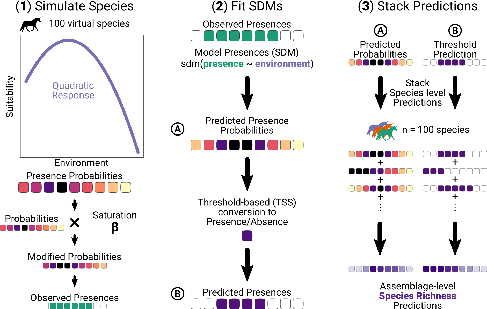

```{r setup, echo = FALSE}
knitr::opts_chunk$set(echo = FALSE, message = FALSE, warning = FALSE,
                      cache = TRUE, fig.path = "figures/", dpi = 1000)

library("knitr")
```


# Highlights

* Habitat saturation impacts predictions from Species Distribution Models (SDM)
* Habitat saturation biases stacked SDMs (S-SDMs) predictions
* Probability-based richness predicts local SR without bias whatever habitat saturation
* Comparing different S-SDMs predictions can shed light on community assembly processes

# Introduction

Species Richness is an Essential Biodiversity Variable (EBV) [@Pereira_Essential_2013], which should be assessed, monitored and compared across space, time, and ecological contexts. Different models have been proposed for richness prediction in diverse ecological contexts and at large spatial scale [@Dodson_Predicting_1992; @OBrien_Waterenergy_1998; @Graham_comparison_2006], with the perspective of identifying biodiversity hotspots [@Mazel_Multifaceted_2014; @Myers_Biodiversity_2000], targeting effective management practices [@Chown_Energy_2003], quantifying biodiversity changes [@Newbold_Global_2015] and predicting ecosystem functioning [@Cardinale_Biodiversity_2012].

Several methods can be used to predict richness depending on which ecological processes are at play. For example, Macro-Ecological Models (MEMs) directly predict richness at any location as a function of local environmental variables. These models consider the influence of environmental filtering and energy limits on richness [@Hurlbert_When_2014]. Because site-species data are first aggregated to estimate richness and then used to predict the variation with the environment, these approaches are called 'assemble first, predict later' [@Ferrier_Spatial_2006]. Conversely, more and more global and local biodiversity databases include species occurrences instead of local assemblage composition [@GBIF_2019; @Sullivan_eBird_2009; @Tedesco_global_2017]. An alternative approach has been to first model occurrences, independently for each species, at any location using environmental variables through species distribution models (SDMs) [@Guisan_Predicting_2005; @Guisan_Predictive_2000], then to deduce potential local richness by combining (=stacking) the predictions of individual SDMs [@Calabrese_Stacking_2014; @DAmen_Predicting_2015; @Gavish_Accounting_2017; @Scherrer_How_2018; @Schmitt_ssdm_2017], which is known as the 'predict first, assemble later' approach [@Ferrier_Spatial_2006]. When stacking SDMs, each SDM predicts occurrences for species independently using environmental variables [@Guisan_Predictive_2000]. Then, predictions of SDMs for different species are summed to predict richness at assemblage-level. Stacked-SDMs (S-SDMs) predict observed richness as well as or better than macro-ecological models [@Dubuis_Predicting_2011; @Guisan_SESAM_2011], but there is still no consensus on the stacking method to be used so as to reliably predict richness with S-SDMs [@Scherrer_How_2018].

Two main methods exist to stack SDMs [@Dubuis_Predicting_2011; @Pineda_Assessing_2009; @Scherrer_How_2018]. Some authors suggested using thresholds to convert probabilities to binary predictions (presence and absence) [@Jimenez-Valverde_Threshold_2007; @Liu_Selecting_2005]. These binary predictions are then summed to predict richness at local scale (hereafter threshold-based richness). One of the main arguments for conversion of probabilities provided by SDMs to binary predictions is that most of practical applications need binary maps [@Jimenez-Valverde_Threshold_2007]. A caveat of binary predictions is that they translate continuous responses of species along environmental gradients into binary responses, which imply more abrupt shifts from presence to absence between suitable and unsuitable conditions [@Meynard_effect_2012]. When predicted probabilities are under the threshold, the model only predicts absences, while it only predicts presences when predicted probabilities are above it. Close to the threshold value, a small change in predicted presence probability can change the binary prediction from absence to presence. Meynard et al. [-@Meynard_effect_2012] showed that presence predictions using thresholds fit observed presences only when species has a threshold-like response, while error increases when a species response is more gradual. The more species considered that have a gradual response along the environment, the greater the error when predicting richness. SDMs also directly provide continuous presence probabilities as outputs [@Guisan_Predicting_2005], and threshold conversion to binary predictions adds a step compared to the direct sum of individual model predictions. Summing the probabilities of individual species model provides the mathematical expectation of the number of species locally present, assuming that species occurrences are independent [@Calabrese_Stacking_2014; @Violle_Plant_2011], hereafter called probability-based richness.

A basic implicit assumption of SDMs is that only environmental conditions determine species occurrence, depending on a species fundamental niche [@Guisan_Predictive_2000]. Additional processes should affect the realized occupancy patterns, such as dispersal limitation, competitive exclusion, local extinction dynamics [@Pulliam_relationship_2000]. SDM predictions and thus richness predictions are likely to be biased by neglecting the contribution of processes shaping realized species distributions beyond their fundamental niche requirements [@Vaclavik_Equilibrium_2012], thereby affecting SDM predictions and thus richness predictions. For instance, due to source-sink dynamics, some species can occupy less suitable sites, and thus be distributed outside the suitable habitat delimited based on presence probabilities predicted by SDMs. In addition, a species that is less often present across its suitable habitat would have a lower predicted presence probability than a species that is present in all its suitable habitats, even though the predicted binary distribution of an SDM would be the same. We define habitat saturation of a species as a parameter that affects species occurrence probability based on environmental suitability. Here saturation is a species-level property and not an upper bound for richness in assemblages as proposed by Mateo et al. [-@Mateo_Biodiversity_2017]. When species display low habitat saturation, their realized presence probabilities decrease, so that the predicted summed probability gets lower. On the contrary, the threshold-based presence prediction is not affected, by habitat saturation. Indeed, even if the determined species threshold changes with habitat saturation, the prediction will still be binary (presence or absence) [@Meynard_effect_2012], thus we expect to observe increasing difference between threshold-based and observed richness with lower (or higher) habitat saturation.

Predicted presence probabilities partly reflect the ability of species to saturate their niche. Therefore, we expect probability-based richness to best predict actual richness. While we expect threshold-based richness to over-predict actual richness. Threshold-based richness rather represents a pool of species able to occur in given environmental conditions. To test these expectations we simulated virtual species with varying saturation and niche requirements [@Hirzel_Assessing_2001; @Meynard_Testing_]. We performed S-SDMs to predict richness given environmental conditions using both threshold- and probability-based richness and compared how the predictions were affected by habitat saturation. Probability-based richness followed observed richness whatever the habitat saturation, while threshold-based richness only matched observed richness when habitat saturation was 100%. Threshold-based richness only considered the environmental requirements of species, and could thus be used as the prediction of potential richness based solely on local environmental conditions. Potential richness could then be compared with other richness predictions that incorporate other ecological processes.

# Material and Methods {#MM}

## Species assemblage simulations

**Individual species simulation**. We simulated a linear environmental gradient of 2000 values, from 1 to 2000. We then used the `virtualspecies` package version 1.4-2 [@Leroy_virtualspecies_2016] to define 100 species independently, with quadratic environmental response $s_{i,k} = a \times \text{Env}_k^2 + b \times \text{Env}_k$, with $s_{i,k}$ the environmental suitability of species $i$ in assemblage $k$ and $\text{Env}_k$ the environmental variable. $a$ was drawn from a uniform distribution between -20 and -0.01. $b$ was chosen as $b = - m * 2 * a$ where $m$ was drawn from a uniform distribution between 1 and 2000 and represents the environment of maximum suitability. The suitability was then scaled between 0 and 1 by subtracting its minimum and dividing by the difference of its maximum and minimum. We used the function `generateRandomSp()` in `virtualspecies` to get suitability probabilities for each species and each environmental value (see Figure \@ref(fig:simulationroutine) left column).

**Habitat saturation and predicted assemblages**. We simulated species presences along the environmental gradient by performing binomial draws based on the presence probabilities. The presences probabilities $p_{i,k} = s_{i,k} \times \beta$ depend on (i) the suitability probabilities defined above, $s_{i,k}$ for species $i$ and assemblage $k$, reflecting fundamental niche requirements, and (ii) an additional habitat saturation coefficient $\beta$ representing the ability of species to occupy their suitable habitat (realized niche). When saturation is below 100%, the species tend to be less often present in suitable sites than species at 100% saturation (e.g., due to dispersal limitation or extinction). Species can also reach a saturation over 100% when they are present in less suitable conditions than according to their fundamental niche (e.g., through source-sink dynamics). We simulated 8 values of $\beta$: 10%, 40%, 70%, 100%, 120%, 150% and 170%. If the weighted probability of presence was greater than one, we reduced it to a maximum of one. We thus simulated each species assemblage $k$ for each value $\beta$.

## Individual and Stacked Species Distribution Models

We performed Species Distribution Models (SDM) based on simulated species presences.

**Modeling and Predicting Presences**. We modeled the presence of each species using two predictors: the environmental value and the square of this value (see Figure \@ref(fig:simulationroutine) middle column) in Generalized Linear Models (GLM) of the binomial family:
\begin{equation}
\text{logit}(p_{i,k}) = \beta_0 \text{Env}_k + \beta_1 \text{Env}^2_k
\end{equation}
with $p_{i,k}$ the presence of species $i$ in assemblage $k$ and $\text{Env}_k$ its associated environmental variable.
We thus estimated in each assemblage the probability of finding each species. For each species we determined the best threshold to get binary predictions by maximizing the True Skill Statistic (TSS) [@Allouche_Assessing_2006]. The TSS balances the proportion of presences correctly predicted and the proportion of absences correctly predicted.

**Predicting Species Richness**. We stacked SDM predictions in each assemblage to get a prediction of richness, with two approaches. We first summed the predicted presence probability for each species (probability-based richness, prediction **(A)** in Figure \@ref(fig:simulationroutine)):

\begin{equation}
pred_{\text{rich}, \text{prob}, k} = \sum_{i = 1}^{S} p_i(k),
\end{equation}
with $pred_{\text{rich}, \text{prob}, k}$ the probability-based predicted richness in assemblage $k$, $S$ the total number of species in the species pool, and $p_i(k)$ the predicted presence probability of species $i$ in assemblage $k$.
Using these probabilities we determine a species-specific threshold $t_i$ using the True Skill Statistic [@Allouche_Assessing_2006] that defines a binary function $1_i(k)$ to predict the presence of the species in each assemblage:
\begin{equation}
1_i(k) :=
    \begin{cases}
    1 & \text{if } p_i(k) \geq t_i\\
    0 & \text{if } p_i(k) < t_i
    \end{cases},
\end{equation}
with $p_i(k)$ the predicted presence probability of species $i$ in assemblage $k$ and $t_i$ the species $i$ threshold defined using TSS.
We then compared the sum of predicted presence probabilities $pred_{\text{rich}, \text{prob}, k}$ to the sum of predicted presences with species-specific threshold (threshold-based richness, prediction **(B)** in Figure \@ref(fig:simulationroutine)):
\begin{equation}
pred_{\text{rich}, \text{thresh}, k} = \sum_{i = 1}^{S} 1_i(k),
\end{equation}
with $pred_{\text{rich}, \text{thresh}, k}$ the threshold-based predicted richness in assemblage $k$, $S$ the total number of species in the species pool and $1_i(k)$ the indicator function defined as above.

We examined how predicted richness fitted observed richness across the whole environmental gradient, for different levels of habitat saturation. We quantified the deviation with Root Mean Square Error (RMSE):
\begin{equation}
\text{RMSE} = \sqrt{\frac{1}{N_k}\sum_{k = 1}^{N_k} (pred_{\text{rich}, k} - obs_{\text{rich}, k})^2},
\end{equation}
with $pred_{\text{rich}, k}$ the predicted richness of a given method in assemblage $k$, $obs_{\text{rich}, k}$, the observed richness in this assemblage, and $N_k$ the total number of assemblages.
We defined Bias and Variance components:
\begin{equation}
\text{Bias} = \frac{1}{N_k}\sum_{k = 1}^{N_k} (pred_{\text{rich}, k} - obs_{\text{rich}, k})
\end{equation}
\begin{equation}
\text{Variance} = \frac{1}{N_k}\sum_{k = 1}^{N_k} (pred_{\text{rich}, k} - \widehat{pred_{rich}})^2
\end{equation}
with $\widehat{pred_{rich}}$ the average predicted richness of a given method across all assemblages.

All analyses and SDMs were performed using R version 3.5.2 [@RCore_Language_2019]. A version of the code used in this article is archived on Zenodo (https://doi.org/10.5281/zenodo.3345742).

# Results

Binary predictions (solid segments above and below the plot) showed few differences whatever habitat saturation (Figure \@ref(fig:comppresprob)). There were the same from environment 1 to 273, then between environment 467 and 1514, and for environments greater than 1720. In total binary predictions were the same whatever habitat saturation for over 80% of the environmental values. However, binary predictions changed abruptly from absences to presences and from presences to absences for environment close to 500 and to 1500, respectively. On the contrary, the predicted presence probabilities did vary with habitat saturation (solid curves in the center). The greater the habitat saturation, the greater the maximum predicted probability. For example at 100% habitat saturation, the maximum predicted probability was close to 0.95, while at 70% saturation it was 0.7.

When comparing observed richness to probability-based richness and threshold-based richness (respectively green and purple points and curves on Figure \@ref(fig:pred-obs-rich)), we observed differences depending on habitat saturation. Across all habitat saturation levels, probability-based richness showed consistently lower RMSE and variance than threshold-based richness (Figure \@ref(fig:rich-rms-cor)). For habitat saturation below 100%, threshold-based richness was greater than observed richness, while probability-based richness followed observed richness. Observed richness against probability-based richness followed the identity line closely with a slope not different from one (all $p > 0.5$, $\text{H}_0$ being that the slope is not different from one) and an intercept not different from zero, related to zero bias at all habitat saturation levels (Figure \@ref(fig:rich-rms-cor) middle). The relationship between observed richness and threshold-based richness was not linear and did not follow the identity line whatever habitat saturation. Probability-based richness showed similar RMSE at all habitat saturation levels, while threshold-based richness reached its minimum RMSE when habitat saturation was 80%.
When species under-saturated their habitats ($\beta$ < 100%), probability-based richness followed closely observed richness while threshold-richness almost always over-predicted richness. Threshold-based richness lowest RMSE at 80% habitat saturation can be explained by a balance between slight under-prediction when richness was smaller than 75 and over-prediction when richness was greater than 75 (Figure \@ref(fig:pred-obs-rich)).
When habitat saturation reached 100%, both types of predictions were close to observed richness (Figure \@ref(fig:pred-obs-rich)). At this habitat saturation, threshold-based richness showed slight over-prediction in richer communities (predicted richness around 90 species for sites containing 80 species) and slight under-prediction in poorer sites (predicted richness of around 30 for sites containing 45 species), and an average under-prediction (negative bias). At this habitat saturation, the RMSE of both methods was close to the one at 80% habitat saturation, but the variance in prediction increased for probability-based richness.
When species over-saturated their habitats ($\beta$ > 100%), threshold-based richness strongly under-predicted richness in poorer communities (negative bias) while probability-based richness showed no bias on average (Figure \@ref(fig:rich-rms-cor) middle). For example at 150% habitat saturation, for sites with observed richness around 75, threshold-based richness was around 30 while probability-based richness was 75.

# Discussion

We designed a virtual experiment of species occurrences along an environmental gradient and performed binomial GLM-based species distribution modeling on these data. The binary threshold-based presence prediction represented the potential habitat of each species based on its fundamental niche [@Guisan_Predictive_2000], whatever its actual habitat saturation. On the contrary, the range and average values of predicted presence probabilities depended on habitat saturation, for a given fundamental niche. When summing the individual species predictions, the summed presence probabilities well fitted actual richness, as expected, while habitat saturation strongly affected the threshold-based richness. We thus recommend summing stacked-SDMs probabilities to predict richness. Still, threshold-based richness can also be a useful predictor of potential richness, as species threshold-based binary predictions can be used as a reference species pool for hypothesis testing and modeling of biodiversity dynamics.

In our simulations, probability-based richness on average followed observed richness whatever habitat saturation. This is in line with the fact that probability-based richness should provide the mathematical expectation of richness at a given site [@Calabrese_Stacking_2014]. Our results also showed that probability-based richness had a consistently lower RMSE than threshold-based richness, mostly because of its absence of bias. However, both methods had higher variance with higher habitat saturation, as a consequence of a mean-variance relationships. Thus at high habitat saturation, both methods predict an unreliable richness.

Much emphasis has been put in species distribution modeling on providing binary occurrence prediction. Methods to define thresholds for reliable occurrence prediction have been extensively debated and alternative options have been proposed [@Liu_Selecting_2005; @Allouche_Assessing_2006; @Freeman_comparison_2008; @Liu_Selecting_2013]. However, such a prediction does not grasp the inherently gradual response of species to environmental gradients [@Hutchinson_Concluding_1957; @Meynard_effect_2012], and tends to generate an artificial dichotomy. This "binarization" has two major caveats. First, it does not acknowledge the gradual variation of performance along the gradient, which increases under-prediction below the threshold and over-prediction above the threshold. Furthermore, the closer to the threshold the higher the prediction bias: just over/below the threshold, there is a greater chance to find a species present/absent than further away from the threshold. Second, it predicts only presences above the threshold and only absences below the threshold, which does not acknowledge the influence of habitat saturation irrespective of habitat suitability. In other words, threshold-based richness will always estimate richness as if species habitat saturation was 100%. Because threshold-based richness over-predicts richness for habitat saturation under 100% (or under-predicts when habitat saturation is over 100%), its accuracy regarding the prediction of species turnover may be low [@DAmen_Predicting_2015; @Dubuis_Predicting_2011]. At coarser and larger scales, because niche preferences dominate the distribution of species [@Pearson_Predicting_2003], we expect a more deterministic response to the environment in a threshold-like fashion [@Guisan_Predicting_2005]. Species response to environmental gradients is thus highly scale-dependent, specific at local and fine scales and threshold-like at large and coarse scales [@Meynard_Using_2013]. The assumption that species distribution at large and coarse scales is in a threshold fashion [@Guisan_Predicting_2005] has been difficult to prove [@Boucher-Lalonde_consistent_2014; @Boucher-Lalonde_How_2012]. Instead in birds, mammals and North American trees, a Gaussian distribution best explained the occurrence-environment relationship for most species [@Boucher-Lalonde_consistent_2014; @Boucher-Lalonde_How_2012], while the threshold model was selected only 5% of the time. Only a fraction of species responds to broad environmental gradients in a binary way. Meynard et al. [-@Meynard_Using_2013] also argued that threshold response of species observed in many datasets could be the results of data aggregation over various spatial and temporal scales.

We defined habitat saturation as a coefficient ($\beta$) that affects environmental suitability of species: it increases ($\beta > 1$) or decreases ($\beta < 1$) habitat suitability. It has been shown in diverse taxa that most species do not saturate their habitat: they occupy less habitat than their potential habitat [@Boucher-Lalonde_How_2012; @Munguia_Dispersal_2008; @Svenning_Limited_2004]. Several mechanisms can explain why a species under-saturates its habitat. For example, dispersal limitation due to slow recolonization of European trees from glacial refugia has led to habitat under-saturation [@Svenning_Limited_2004]. Biotic interactions are often cited as an additional factor explaining habitat under-saturation [@Svenning_Limited_2004], as species close in traits can experience limiting similarity and competitively exclude one another. On the contrary, positive biotic interactions as well as source-sink dynamics can cause habitat over-saturation [@Eriksson_Regional_1996; @Pulliam_relationship_2000; @Pulliam_Sources_1991]. Positive interactions such as facilitation make facilitated species occupy less suitable habitat thanks to the presence of other species [@Bertness_Positive_1994; @Stachowicz_Mutualism_2001]. Source-sink theory explains how a species can be present in unsuitable habitat (sink) by continuously immigrating from a suitable habitat (source) [@Pulliam_Sources_1991]. Here we considered a single habitat saturation coefficient ($\beta$) used for all species across all assemblages. This coefficient does not take into account the variability of habitat saturation that may exist between species, where some species saturate more their habitat then others. Furthermore, the habitat saturation coefficient cannot take into account biotic interactions as it is not conditional to the presence of other species; nor that we expect source-sink dynamics to occur only close to the sources, which should lead to a context-dependent habitat saturation. Habitat saturation is also influenced by the extent to which it is measured. In very small areas (e.g., a single quadrat), species tend to fully saturate their suitable habitat, because they occupy the only micro-habitat available for them. For larger areas (e.g., several plots), the occurrence of species should be more stochastic due to dispersal limitation, limiting similarity and biotic interactions as stated above. For even larger areas (e.g., regional, continental or global), habitat saturation should increase again with the dominance of deterministic processes that influence occurrence. As such, we could use a species habitat saturation profile at different areas whose variation would show the change in main assembly processes. Further research is needed regarding habitat (un-)saturation to understand its causes and consequences.

A recent study mentions a different but related concept of saturation [@Mateo_Biodiversity_2017]. Mateo et al. [-@Mateo_Biodiversity_2017] defined saturation as "environmental constraints [that] limit the number of species that can coexist in a community". Here, we defined habitat saturation as a species-level pattern: it represents the proportion of suitable habitat that a species occupies, it is a species-level property not a community-level property. Community saturation, i.e. saturation *sensu* Mateo et al. [-@Mateo_Biodiversity_2017], depends on habitat saturation of species. If species have a limited habitat saturation, it imposes an upper bound to species richness. In our model, there are no strict limits on species richness, but on each species' capacity to saturate its habitat. The neutral theory imposes a limit on the number of individuals in any community [@Hubbell_unified_2001], it is a subset of the invidividuals/species present in the species pool that encompasses a larger area. Changes in number of individuals per community, species regional abundances and/or immigration probability $m$ from the species pool can cause changes in species habitat saturation. By choosing these three parameters, we can obtain a stable richness that can be interpreted as an upper bound, as if saturation was community-level process. However, in this case there is no direct bound on species richness. Richness results from the dynamic extinction-colonization equilibrium and fluctuates over time, it is not a property of the community *per se*. Mateo et al. [-@Mateo_Biodiversity_2017] focused mostly on S-SDMs that can be be constrained with an explicit constraint on richness. As stated above, species richness is unlikely to be directly constrained and thus modeling explicitly a richness constraint may not underline the true community assembly mechanisms that affect community composition.

Our model, while an interesting basis to test assumptions regarding SDM stacking, represents an ecologically idealistic situation that uses virtual species. We used a single linear environmental gradient, which is an over-simplification of environmental gradients. Indeed, species occurrences are jointly affected by multi-dimensional environmental gradients, which can be non-linear and lead to observed trait syndromes [@Laughlin_Fitness_2015]. In our simulations, all species have a single trait with a single optimum, however with multi-dimensional environmental gradients we could also expect multi-dimensional optima [@Oksanen_Continuum_2002]. Our simulations do not consider biotic interactions, as we simulated the presence of species independently, while, as stated above, biotic interactions can strongly influence species habitat saturation [@Pulliam_relationship_2000]. We used a species pool containing species with optima on the whole range of the environmental gradient. However, the distribution in species optima among the species pool can be asymmetrically distributed, which in turn can affect local community assembly dynamics [@Patrick_Species_2018]. Furthermore, because of the way the species were simulated, most species niche breadth covered around one third of the range of the environment. While real communities contain a mix of species with narrow and wide niches, with many of species having narrow niches and a few having wide niches [@Brown_Relationship_1984]. Thus, we could determine a ratio between species with wide and narrow environmental niches, based on observed communities, and simulate virtual communities accordingly. We also assumed that species' suitabilities had a quadratic response to the environment, while more complex relationships exist [@Oksanen_Continuum_2002] and could be used in our model. Our simulation setup can thus be made more complex for more investigations on factors that may influence S-SDMs richness predictions. Still, our simplified model can help gain insights about S-SDMs.

Depending on the scales considered, we can expect different shapes of species occurrence-environment relationships. At local scale, we expect many stochastic processes (e.g., demographic stochasticity, competitive exclusion, biotic interactions, microclimatic variations, etc.) to be at play and drive community assembly [@Chase_Disentangling_2011]. Dominance of stochastic processes leads to blurred response to environmental variables, because species occurrence is then not only determined by environmental variables. Predicted presence probability can account for these processes, because they predict the parameter that governs the stochastic process leading to species occurrence such as a binomial trial [@Pottier_accuracy_2013]. Indeed, probability-based richness have been shown to estimate the richness of local assemblages well [@Calabrese_Stacking_2014; @DAmen_Predicting_2015; @DAmen_Using_2015; @Guisan_SESAM_2011; @Pellissier_probabilistic_2013].

Threshold-based richness can be thought as the potential richness expected considering only abiotic deterministic processes. It can be a useful baseline to compare to models that consider a broader set of processes [@Pouteau_Disentangling_2019; @Violle_Plant_2011]. Threshold-based richness defines a reference pool against which null models or hierarchical analyses can be performed. It can be considered as an additional method to define species pool [@Carstensen_Introducing_2013; @Lessard_Inferring_2012]. Indeed, threshold-based richness would represent a species pool [@Lessard_ProcessBased_2015] that considers only the response to environmental filtering for a large area. Without explicitly considering functional traits, threshold-based richness can also represent a functional species pool as species traits are filtered by the environment [@Bello_Functional_2012]. Threshold-based richness is nested in a hierarchy of models similar to the hierarchy of scales and processes that shape community assembly [@Keil_Downscaling_2013; @Mackey_hierarchical_2001; @Mertes_Disentangling_2018; @Meyer_Does_2007; @Pearson_Predicting_2003]. Threshold-based predictions, because they consider environmental filtering only, are representative of coarse and large scales in this hierarchy of models. In the SESAM framework [@DAmen_Using_2015; @Guisan_SESAM_2011], threshold richness is a reference richness before applying a cutoff in species presences to account for local variations. The use of threshold-based predictions can thus be compared to more mechanistic models, to know to what extent observed communities are mostly shaped by environmental filtering. Other models, to which they can be compared, can incorporate other important community assembly factors such as dispersal limitation, limiting similarity or biotic interactions [@Chase_Disentangling_2011; @Munoz_ecolottery_2017; @Pouteau_Disentangling_2019; @vanderPlas_new_2015].
In summary, using both threshold-based richness and probability-based richness in succession —first threshold-based richness as a pure environmental prediction then compare it to probability-based richness— can shed light on community assembly processes. When both agree, environmental filtering dominates community assembly. If not, habitat saturation can strongly change threshold-based richness and/or other processes may affect community assembly. Threshold-based richness and probability-based can further be compared to other predictions using process-based models that consider additional processes. Essential Biodiversity Variables can be measured using multiple methods [@Pereira_Monitoring_2017], and there is no clear recommendation on which method should be prioritized to predict EBVs. Probability-based species richness could be used as a reliable method to predict taxonomic diversity in the EBV framework, while threshold-based richness can be a useful tool to assess community assembly processes [@Pouteau_Disentangling_2019].

# Acknowledgments

We would like to thank Pierre Denelle and Christine Meynard for helpful discussions. MG was supported by the ENS de Lyon. This study was supported by the European Research Council (ERC) Starting Grant Project 'ecophysiological and biophysical constraints on domestication in crop plants' (grant ERC-StG-2014-639706-CONSTRAINTS) and by the French Foundation for Research on Biodiversity (FRB; <www.fondationbiodiversite.fr>) in the context of the CESAB project 'causes and consequences of functional rarity from local to global scales' (FREE).

# References

<div id = "refs"></div>

# Figures

```{r simulationroutine, fig.cap="(ref:simulationroutine-cap)", out.width="8in"}

```

(ref:simulationroutine-cap) Full Simulation routine. **(1)** We first simulated 100 virtual species with quadratic environmental suitability curves with randomly sampled coefficients. We multiplied each predicted presence probability by the habitat saturation level then use these probabilities to draw realized presences (see Material and Methods for details). Then, using the modified probabilities we drew presences in each assemblage following a binomial distribution. **(2)** We analyzed the realized presences with a binomial Generalized Linear Model (GLM), independently for each species, which provided predicted presence probability of each species in each assemblage **(A)**. We defined a threshold based on True Skill Statistic [see [Material and Methods] for details, Allouche et al. -@Allouche_Assessing_2006]. This gave the second set of predictions: **(B)** binary predictions. **(3)** Finally, we summed individual predictions in each assemblage for all the species to get two richness predictions.

```{r comppresprob, fig.cap = "(ref:comppresprob-cap)", fig.height = 4, fig.width = 8}
drake::readd(fig_theo_real_one_sp) +
    ggplot2::theme(text = ggplot2::element_text(size = 12))
```

(ref:comppresprob-cap) Species expected and predicted presence probability with and without threshold. The solid curves are the predicted presence probabilities by the GLM used to model the presence of species. The dotted curve is the expected relationship given by the parameters of the species. Segments above and below respectively show predicted presences and absences using species-specific threshold.

```{r pred-obs-rich, out.width="8in", fig.cap = "(ref:pred-obs-rich-cap)", fig.width = 6.3}
drake::readd(fig_rich_pred_obs) +
  ggplot2::theme(text = ggplot2::element_text(size = 10),
                 axis.text.x = ggplot2::element_text(
                   size = ggplot2::rel(0.8)
                 ),
                 aspect.ratio = 1)
```

(ref:pred-obs-rich-cap) Observed vs. predicted richness between two prediction methods as a function of habitat saturation. Each facet shows different species habitat saturation (see [Material and Methods]). The dashed line is the identity line (y = x), indicating perfect predictions. Green points are probability-based richness predictions; Purple points are threshold-based richness predictions. The corresponding colored lines are cubic splines smoothers trend lines. Spearman correlation coefficients are shown in the top left corner of each facet.

```{r rich-rms-cor, fig.align='center', fig.cap = "(ref:rich-rmse-cor-cap)", fig.width=6.3}
drake::readd(fig_rich_rmse_cor) +
  ggplot2::theme(text = ggplot2::element_text(size = 12),
                 axis.text.x = ggplot2::element_text(
                   size = ggplot2::rel(1)
                 ))
```

(ref:rich-rmse-cor-cap) Prediction accuracy of probability-based and threshold-based richness predictions in function of habitat saturation. Green points and lines: probability-based richness; purple points and lines: threshold-based richness. **(left)** Root Mean Square Error (RMSE) of predicted richness, the average error of richness prediction; **(middle)** Bias, the average difference across all assemblages between predicted and observed richness; **(right)** Variance, the variance of richness predictions across all assemblages.
